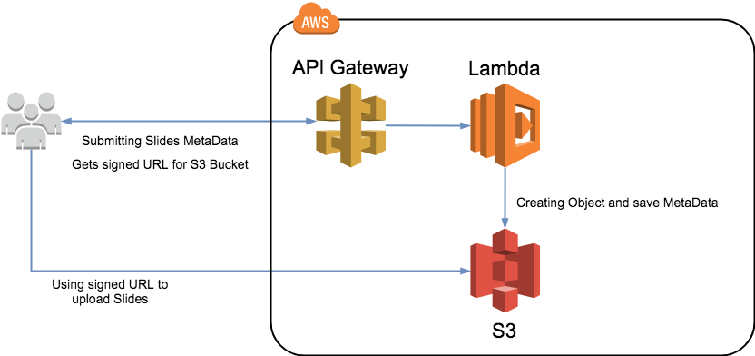

This is the AWS Backend for the OC Papersubmission System
==============================================

Uploading Slides
---
For uploading Slides the **/slides** POST Request must be used. The Request creates a folder in the
Slides S3 Bucket and saves the Metadata provided in the POST Request. The slides binary is not handled by the API
directly because of the size limitations for the API Gateway and Lambda request.
The executed function will create a signed URL for the S3 Bucket. This URL can be used to upload the slides.

